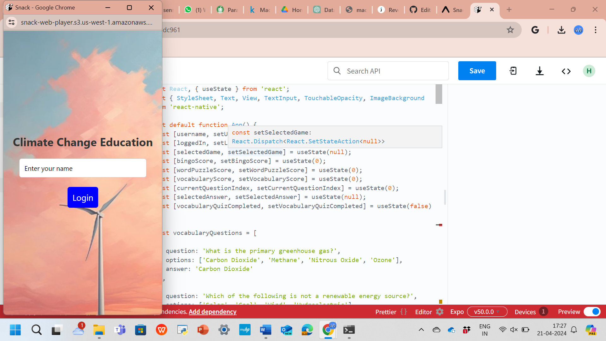
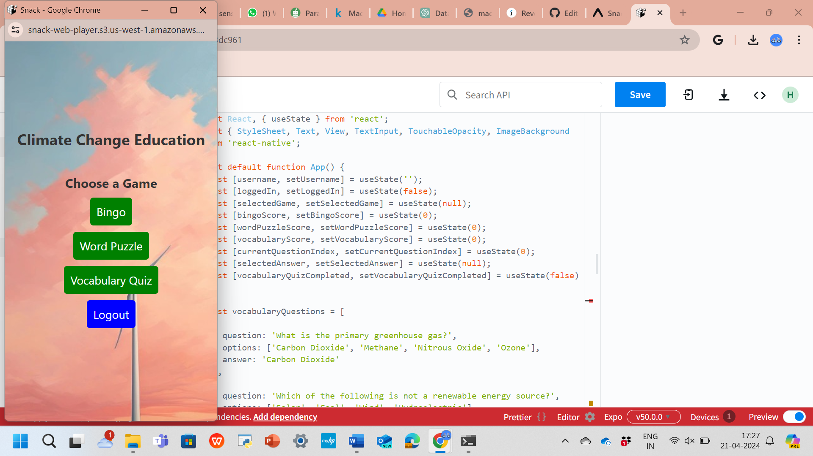
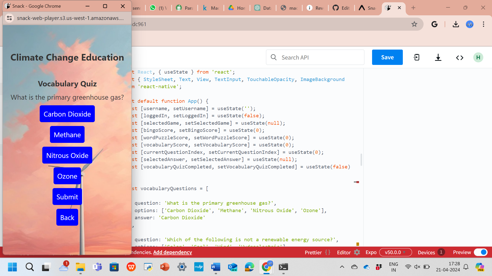
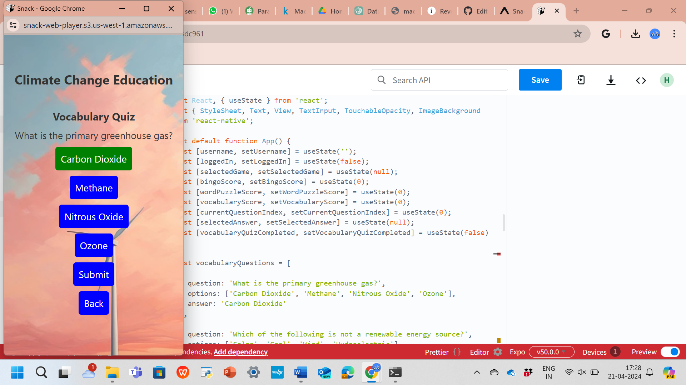
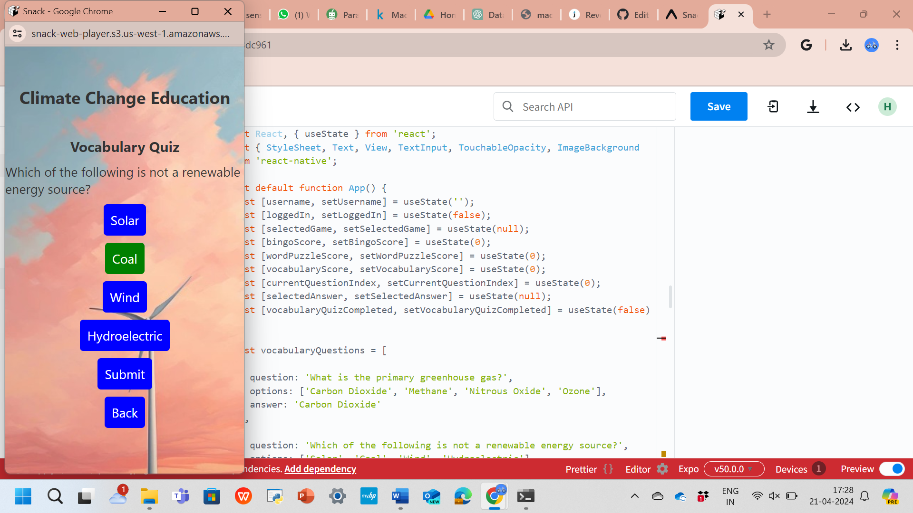
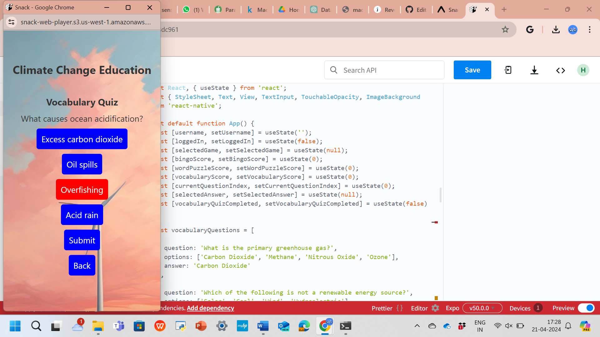

# Tech-team18
This is a final project of our Group for subject Tech for mobile apps.

# Subject: Tech for Mobile apps

## Instructor: Dr. William Agangiba

# Project Title: Climate_Awareness Mobile app game developed using React-native and Expo CLI - (Project team-18)

# Team members
1. Venkata Narayana Reddy, tangirvd@mail.uc.edu
   Profile photo:
3. Hemanth Isaac Dupati, dupatihr@mail.uc.edu
   Profile photo:
5. Hadeel Shaik, shaikhl@mail.uc.edu
   profile photo:

# Project Management Information

Project homepage (public): <https://github.com/shaikhl-12/Tech-team18>

# Overview
In this project we have created a Climate_awareness game in mobile app by using react native and Expo CLI.

This app is designed to educate users about climate change through various interactive games and quizzes.

## Features

- Login functionality
- Three educational games: Bingo, Word Puzzle, and Vocabulary Quiz
- Track scores for each game

# code: 
we have used codes from previous labs and sessions of our subject tech for mobile apps and utilized those codes as freference and done the project.

import React, { useState } from 'react';
import { StyleSheet, Text, View, TextInput, TouchableOpacity, ImageBackground } from 'react-native';

export default function App() {
  const [username, setUsername] = useState('');
  const [loggedIn, setLoggedIn] = useState(false);
  const [selectedGame, setSelectedGame] = useState(null);
  const [bingoScore, setBingoScore] = useState(0);
  const [wordPuzzleScore, setWordPuzzleScore] = useState(0);
  const [vocabularyScore, setVocabularyScore] = useState(0);
  const [currentQuestionIndex, setCurrentQuestionIndex] = useState(0);
  const [selectedAnswer, setSelectedAnswer] = useState(null);
  const [vocabularyQuizCompleted, setVocabularyQuizCompleted] = useState(false);

  const vocabularyQuestions = [
    {
      question: 'What is the primary greenhouse gas?',
      options: ['Carbon Dioxide', 'Methane', 'Nitrous Oxide', 'Ozone'],
      answer: 'Carbon Dioxide'
    },
    {
      question: 'Which of the following is not a renewable energy source?',
      options: ['Solar', 'Coal', 'Wind', 'Hydroelectric'],
      answer: 'Coal'
    },
    {
      question: 'What causes ocean acidification?',
      options: ['Excess carbon dioxide', 'Oil spills', 'Overfishing', 'Acid rain'],
      answer: 'Excess carbon dioxide'
    }
  ];

  const handleLogin = () => {
    console.log('Logged in as:', username);
    setLoggedIn(true);
  };

  const handleGameSelection = (game) => {
    setSelectedGame(game);
    setCurrentQuestionIndex(0); // Reset current question index
    setVocabularyQuizCompleted(false); // Reset quiz completion status
    setVocabularyScore(0); // Reset vocabulary score
  };

  const handleLogout = () => {
    setLoggedIn(false);
    setSelectedGame(null);
  };

  const handleBingoScore = () => {
    setBingoScore(bingoScore + 1);
  };

  const handleWordPuzzleScore = () => {
    setWordPuzzleScore(wordPuzzleScore + 1);
  };

  const handleVocabularyAnswer = () => {
    const currentQuestion = vocabularyQuestions[currentQuestionIndex];
    if (selectedAnswer === currentQuestion.answer) {
      setVocabularyScore(vocabularyScore + 1); // Increase score if the answer is correct
    } else {
      setVocabularyScore(Math.max(0, vocabularyScore - 1)); // Decrease score if the answer is wrong
    }
    // Move to the next question
    if (currentQuestionIndex < vocabularyQuestions.length - 1) {
      setCurrentQuestionIndex(currentQuestionIndex + 1);
      setSelectedAnswer(null); // Reset selected answer
    } else {
      // Quiz completed
      setVocabularyQuizCompleted(true);
    }
  };

  const renderVocabularyQuiz = () => {
    const currentQuestion = vocabularyQuestions[currentQuestionIndex];
    return (
      <View style={styles.gameContainer}>
        <Text style={styles.subtitle}>Vocabulary Quiz</Text>
        <Text style={styles.question}>{currentQuestion.question}</Text>
        {currentQuestion.options.map((option, index) => (
          <TouchableOpacity
            key={index}
            style={[
              styles.button,
              selectedAnswer === option ? styles.selectedButton : null,
              selectedAnswer !== currentQuestion.answer && selectedAnswer === option ? styles.wrongAnswer : null,
            ]}
            onPress={() => setSelectedAnswer(option)}
          >
            <Text style={styles.buttonText}>{option}</Text>
          </TouchableOpacity>
        ))}
        <TouchableOpacity
          style={styles.button}
          onPress={handleVocabularyAnswer}
          disabled={!selectedAnswer}
        >
          <Text style={styles.buttonText}>Submit</Text>
        </TouchableOpacity>
        {vocabularyQuizCompleted && (
          <Text style={styles.score}>Vocabulary Score: {vocabularyScore}</Text>
        )}
        <TouchableOpacity style={styles.button} onPress={() => setSelectedGame(null)}>
          <Text style={styles.buttonText}>Back</Text>
        </TouchableOpacity>
      </View>
    );
  };

  const renderGame = () => {
    switch (selectedGame) {
      case 'Bingo':
        return (
          <View style={styles.gameContainer}>
            <Text style={styles.subtitle}>Bingo</Text>
            <TouchableOpacity style={styles.button} onPress={handleBingoScore}>
              <Text style={styles.buttonText}>Increase Bingo Score</Text>
            </TouchableOpacity>
            <Text style={styles.score}>Bingo Score: {bingoScore}</Text>
            <TouchableOpacity style={styles.button} onPress={() => setSelectedGame(null)}>
              <Text style={styles.buttonText}>Back</Text>
            </TouchableOpacity>
          </View>
        );
      case 'WordPuzzle':
        return (
          <View style={styles.gameContainer}>
            <Text style={styles.subtitle}>Word Puzzle</Text>
            <TouchableOpacity style={styles.button} onPress={handleWordPuzzleScore}>
              <Text style={styles.buttonText}>Increase Word Puzzle Score</Text>
            </TouchableOpacity>
            <Text style={styles.score}>Word Puzzle Score: {wordPuzzleScore}</Text>
            <TouchableOpacity style={styles.button} onPress={() => setSelectedGame(null)}>
              <Text style={styles.buttonText}>Back</Text>
            </TouchableOpacity>
          </View>
        );
      case 'VocabularyQuiz':
        return renderVocabularyQuiz();
      default:
        return (
          <View style={styles.gameContainer}>
            <Text style={styles.subtitle}>Choose a Game</Text>
            <TouchableOpacity style={styles.gameButton} onPress={() => handleGameSelection('Bingo')}>
              <Text style={styles.buttonText}>Bingo</Text>
            </TouchableOpacity>
            <TouchableOpacity style={styles.gameButton} onPress={() => handleGameSelection('WordPuzzle')}>
              <Text style={styles.buttonText}>Word Puzzle</Text>
            </TouchableOpacity>
            <TouchableOpacity style={styles.gameButton} onPress={() => handleGameSelection('VocabularyQuiz')}>
              <Text style={styles.buttonText}>Vocabulary Quiz</Text>
            </TouchableOpacity>
            <TouchableOpacity style={styles.button} onPress={handleLogout}>
              <Text style={styles.buttonText}>Logout</Text>
            </TouchableOpacity>
          </View>
        );
    }
  };

  return (
    <ImageBackground source={require('photo1.jpeg')} style={styles.background}>
      <View style={styles.container}>
        <Text style={styles.title}>Climate Change Education</Text>
        {!loggedIn ? (
          <>
            <TextInput
              style={styles.input}
              placeholder="Enter your name"
              value={username}
              onChangeText={text => setUsername(text)}
            />
            <TouchableOpacity style={styles.button} onPress={handleLogin}>
              <Text style={styles.buttonText}>Login</Text>
            </TouchableOpacity>
          </>
        ) : (
          renderGame()
        )}
      </View>
    </ImageBackground>
  );
}

const styles = StyleSheet.create({
  background: {
    flex: 1,
    resizeMode: 'cover',
    justifyContent: 'center',
  },
  container: {
    flex: 1,
    alignItems: 'center',
    justifyContent: 'center',
  },
  title: {
    fontSize: 24,
    fontWeight: 'bold',
    marginBottom: 20,
    color: '#333',
  },
  subtitle: {
    fontSize: 20,
    fontWeight: 'bold',
    marginBottom: 10,
    color: '#333',
  },
  question: {
    fontSize: 18,
    marginBottom: 10,
    color: '#333',
  },
  input: {
    width: '80%',
    height: 40,
    borderWidth: 1,
    borderColor: '#ccc',
    borderRadius: 5,
    paddingHorizontal: 10,
    marginBottom: 20,
    backgroundColor: '#fff',
  },
  button: {
    backgroundColor: 'blue',
    padding: 10,
    borderRadius: 5,
    alignItems: 'center',
    marginBottom: 10,
  },
  gameButton: {
    backgroundColor: 'green',
    padding: 10,
    borderRadius: 5,
    alignItems: 'center',
    marginBottom: 10,
  },
  buttonText: {
    color: 'white',
    fontSize: 18,
  },
  selectedButton: {
    backgroundColor: 'green',
  },
  wrongAnswer: {
    backgroundColor: 'red',
  },
  gameContainer: {
    marginTop: 20,
    alignItems: 'center',
  },
  score: {
    fontSize: 18,
    marginBottom: 10,
    color: '#333',
  },
  word: {
    fontSize: 18,
    marginBottom: 10,
    color: '#333',
  },
});
# Explanation:

We have created three games Bingo, and two others. one can choose any one game to play.

Firstly, User logins to app by entering the name of his/her. After that he chooses the game, what he wants to play .In background we have kept a beautiful nature photo,such that it attracts user to play and enjoy in the app.

For suppose if he choose vocabulary quiz; The questions will appear on the screen, if he selects any box such that it gets wrong or correct, If its get correct then +1 mark is awarded otherwise -1 mark is awarded.Based on the this thinking while answering questions, utilization of nature thoughts will raise in the mind of a person and such that one can get attracts to the questions and meanings of the environment which makes use of environment life very easy and sophisticated with a planning.

Furthermore,we have implemented the code in a way that if the question appeared on the screen was slected by user and it gets correct, then it was indicated by green color otherwise it goes to red color.

# Screenshots:

# Contribution:
In the team, Everyone contributed very well from scratch by developing the code and doing styling and every next step of project.such that it woulid be wonderful to users to use.

# Results:
Finally. we had developed the mobile app by using React Native and Expo CLI.

# Outcome:
Final motive and outcome we can observe from this app was to be aware of our climate in our day to day life with the actions that we going to perform in the Environment we are living.

